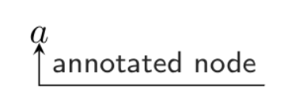

# LaTeX Math Cheat Sheet
## Colors
`\textcolor{`<span style="font-variant: small-caps;">color</sc>`}{`...`}`

For example, `$\textcolor{red}{r}$` gives $\textcolor{red}{r}$
## Over-/Under-brace
`\overbrace{`...`}^{`<span style="font-variant: small-caps;">brace-label</sc>`}`  
`\underbrace{`...`}_{`<span style="font-variant: small-caps;">brace-label</sc>`}`

For example, `$\overbrace{o}^{over}$` gives $\overbrace{o}^{over}$ or `$\underbrace{u}^{under}$` gives $\overbrace{u}^{under}$

## `annotate-equation` <sub>(more info [here](https://github.com/st--/annotate-equations))</sub>
You can also use `\annotate` to annotate anything marked with `\tikzmarknode`. For example,
```
$\tikzmarknode{annotated}{a}$
\annotate{below}{annotated}{annotated node}
```
produces
